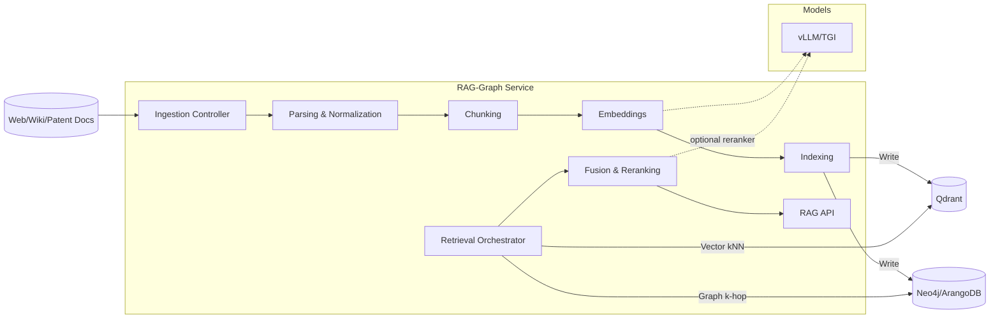

## 03 — Architecture Diagrams (C4-style)

The following diagrams depict the IIA system per the concept paper and the open-source tech stack in 02_Tech_Stack.md. They are expressed with Mermaid using C4-style groupings.

---

### C1 — System Context
```mermaid
flowchart TB
  %% External actors
  user([Human Innovator / Analyst])
  extWeb[(Web / Search APIs)]
  extWiki[(Wikipedia API)]
  extPatent[(Patent DB / APIs)]
  idp[(Keycloak SSO)]
  obs[(Prometheus/Grafana/Loki)]
  ci[(GitHub Actions CI/CD)]

  %% System boundary
  subgraph IIA["Intuitive Inventive Agent (IIA) System"]
    ui[Electron + React App]
    apiGw[API Gateway (Traefik/Kong)]
    orch[Orchestrator API (FastAPI + LangGraph)]
    n8n[n8n External Orchestrator]
  end

  %% Relationships
  user -->|Use| ui
  ui -->|HTTP/gRPC| apiGw
  apiGw --> orch
  orch <-->|OIDC| idp
  n8n <-.->|Jobs/Integrations| orch
  n8n <-.->|Fetch| extWeb
  n8n <-.->|Fetch| extWiki
  n8n <-.->|Fetch| extPatent
  orch <-.->|Telemetry| obs
  ci -->|Deploy| IIA
```

---

### C2 — Container Diagram
```mermaid
flowchart LR
  subgraph Client
    ui[Electron + React (TS)]
  end

  subgraph Edge
    apiGw[Traefik/Kong]
  end

  subgraph Services[IIA Services (FastAPI)]
    orch[Orchestrator + LangGraph]
    triz[TRIZ Service]
    lateral[Lateral Thinking Service]
    rag[RAG-Graph Service]
    eval[Evaluation & Evolution Service]
    workers[Workers (Celery)]
    n8n[n8n Workflows]
  end

  subgraph Data[Data Layer]
    pg[(Postgres)]
    neo[(Neo4j/ArangoDB)]
    qdr[(Qdrant)]
    cache[(Redis)]
    mq[(RabbitMQ)]
    obj[(MinIO - Artifacts/Docs)]
  end

  subgraph Models[Model Serving]
    vllm[vLLM/TGI/Ollama]
  end

  subgraph Observability
    prom[Prometheus]
    graf[Grafana]
    loki[Loki]
  end

  ui -->|HTTP| apiGw --> orch
  orch --> triz
  orch --> lateral
  orch --> rag
  orch --> eval
  orch <--> n8n
  workers <--> mq

  %% Data deps
  rag <--> neo
  rag <--> qdr
  rag <--> obj
  triz --> pg
  eval --> pg
  orch --> cache

  %% Model serving
  triz -. LLM calls .-> vllm
  lateral -. LLM calls .-> vllm
  eval -. creative mutations .-> vllm

  %% Observability
  orch -. OTel .-> prom
  triz -. OTel .-> prom
  rag -. OTel .-> prom
  eval -. OTel .-> prom
  n8n -. OTel .-> prom
  prom --> graf
  loki --> graf
```

---

### C3 — Component Diagram (Orchestrator + LangGraph)
```mermaid
flowchart TB
  subgraph Orchestrator[Orchestrator (FastAPI + LangGraph)]
    api[FastAPI Controllers]
    sg[Session/State Manager]
    lg[LangGraph Graph]
    mem[Run Memory (in Redis/Postgres)]

    subgraph LG_Nodes[LangGraph Nodes]
      nRef[Refine Problem]
      nTRIZ[TRIZ Pipeline]
      nLT[Lateral Thinking]
      nMerge[Merge Candidates]
      nEvo[Evolutionary Refinement]
      nEval[Evaluation / Playoffs]
      nRank[Rank & Explain]
    end
  end

  api --> sg --> lg
  lg --> nRef --> nTRIZ --> nMerge
  nRef --> nLT --> nMerge --> nEvo --> nEval --> nRank
  sg <--> mem

  %% External Calls
  nTRIZ -->|RPC| TRIZ[(TRIZ Service)]
  nLT -->|RPC| Lateral[(Lateral Service)]
  nEvo -->|RPC| Eval[(Evaluation Service)]
  nEval -->|DB| PG[(Postgres)]
```

---

### C3 — Component Diagram (RAG‑Graph Service)


