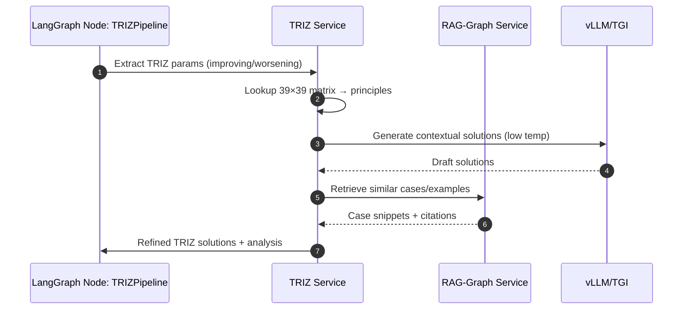
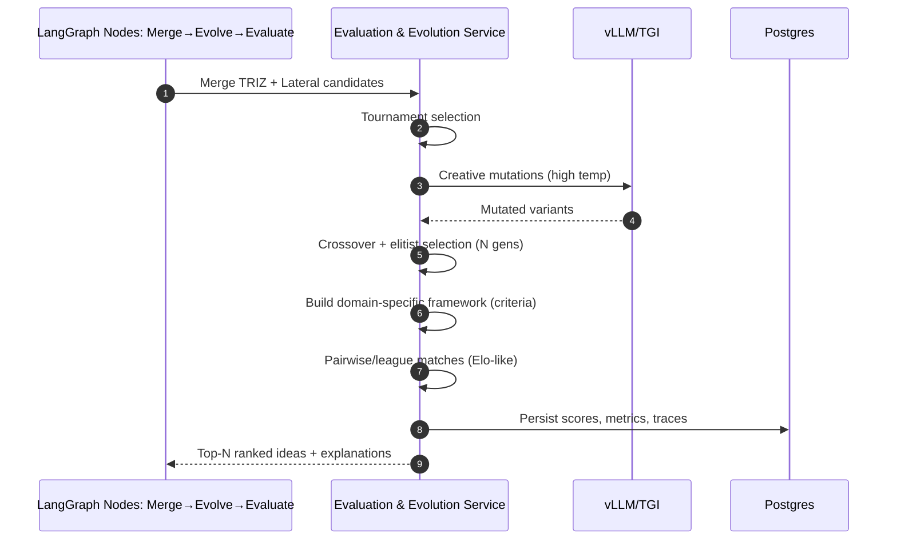
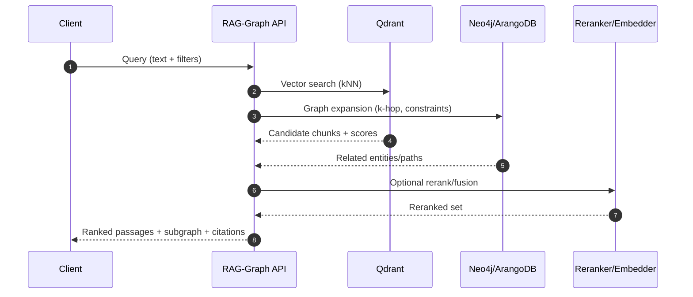
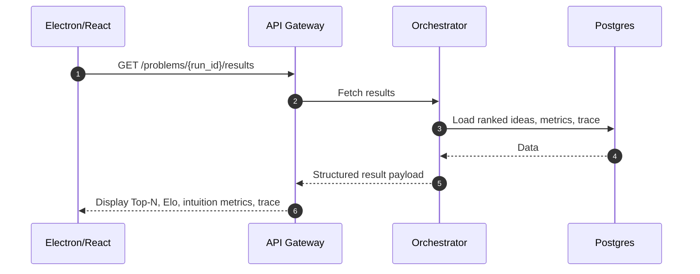

## 04 — Sequence Flows

The following Mermaid sequence diagrams capture the main workflows aligned with the IIA concept and 02_Tech_Stack.md.

---

### 1) Problem Intake & Refinement (Master Orchestration)
```mermaid
sequenceDiagram
  autonumber
  participant User
  participant UI as Electron/React
  participant API as API Gateway
  participant ORCH as Orchestrator (FastAPI+LangGraph)
  participant LG as LangGraph Graph
  participant RAG as RAG‑Graph Service
  participant PG as Postgres

  User->>UI: Submit problem statement + context
  UI->>API: POST /problems/start
  API->>ORCH: Forward request (OIDC checked)
  ORCH->>LG: Start run (initialize state)
  LG->>LG: Refine Problem (prompting, constraints)
  LG->>RAG: Embed/ref context; retrieve related docs
  RAG-->>LG: Context passages + graph subview
  LG->>PG: Persist refined problem + context refs
  LG-->>ORCH: Refined statement, embeddings
  ORCH-->>UI: run_id, status=running
```

---

### 2) TRIZPipeline


---

### 3) LateralThinkingPipeline
```mermaid
sequenceDiagram
  autonumber
  participant LG as LangGraph Node: LateralThinking
  participant LAT as Lateral Service
  participant LLM as vLLM/TGI

  LG->>LAT: Request lateral exploration
  LAT->>LLM: Six Hats perspectives
  LLM-->>LAT: Hat insights
  LAT->>LLM: PMI/CAF runs; provocations; random‑word stim
  LLM-->>LAT: Idea variants (+ PMI stats)
  LAT->>LG: Filtered creative ideas (score >= threshold)
```

---

### 4) Merge + Evolutionary Refinement + Playoffs


---

### 5) RAG‑Graph Retrieval (Hybrid)


---

### 6) End-to-End Result Delivery


